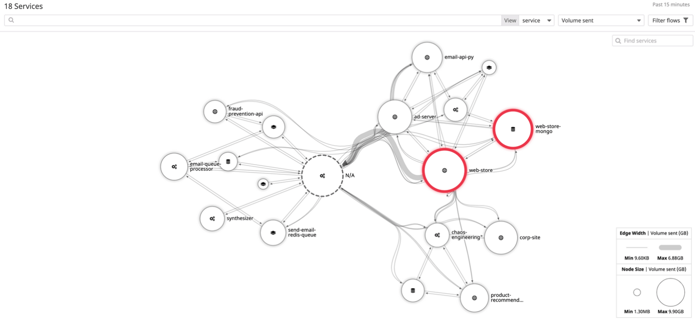
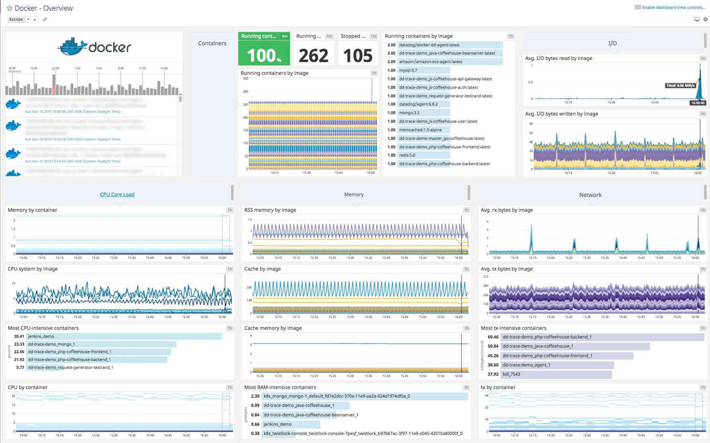

# DataDog

**DataDog은 서버, 데이터베이스, 클라우드 서비스 등에 대한 다양한 모니터링 서비스를 제공하는 클라우드 모니터링 애플리케이션을 대표하는 서비스 중 하나입니다.**

데이터독은 서버 상태를 모니터링하는 기능을 시작으로, `아마존 웹 서비스`, `마이크로소프트 애저`, `구글 클라우드 서비스`들의 서비스와 통합 기능을 제공하고 있습니다.

에이전트의 확장 기능을 통해 데이터베이스, 캐시 스토어 등 다양한 애플리케이션에 대한 추가적인 메트릭 수집과 모니터링을 지원합니다. 

또한 `알람`, `대시보드`, `로그 수집`, `APMApplication Performance Management`, `네트워크 트래픽 모니터링`, `엔드포인트 모니터링` 등을 지원하는 종합 모니터링 서비스로 확장해나가고 있습니다.

#### datadog-agent

데이터독에서는 서버와 추가적인 모니터링을 수행하는 datadog-agent를 개발하고 있습니다. 
**데이터독 에이전트는 모니터링하고자 하는 서버에 설치해서 해당 서버의 정보를 수집하는 역할을 합니다.** 
여기에 추가적인 설정을 통해 `데이터베이스`, `메모리 스토어` 등에서 추가적인 메트릭을 수집할 수 있습니다.

## 주요 개념과 주요 서비스

### 인프라스트럭처 모니터링
데이터독의 기본 기능은 인프라스트럭처 모니터링입니다. **특정 호스트에 데이터독 에이전트를 설치하면 자동적으로 해당 서버의 시스템 정보를 수집합니다.**

- 무료 플랜 : 최대 5개까지의 호스트 모니터링
- 프로 플랜 : 월 $15
- 엔터프라이즈 플랜 : 월 23$

### 인테그레이션
**데이터독에서는 인테그레이션ㅇ르 통해 서버 이외의 다양한 서비스들을 추가적으로 모니터링을 할 수 있습니다.** 인테그레이션은 크게 데이터독 에이전트에서 추가 설정을 통한 방식과 다른 서비스의 API를 통해 연동하는 방식이 있습니다.

사용할 수 있는 서비스는 AWS, 애저, 구글 클라우드, 알리바바, 오픈스택, MySQL, PostgreSQL, K8S, Redis, Docker, Memcached 등 다양한 애플리케이션 모니터링이 가능합니다.

또한 슬랙, 페이저튜티 알림 연동 등 400개 이상의 인테그레이션을 지원하고 있습니다.

### APM(Application Performance Management)
**APM은 애플리케이션 내부에 심어, 애플리케이션의 성능을 분석하는 서비스입니다.**

사용할 수 있는 APM은 자바, 파이썬, 루비, 닷넷, PHP, 고, 노드입니다.

APM을 활성화하려면 애플리케이션 코드 상에 추가 셋업을 해야합니다. APM에 대해서는 대당 월 $31의 추가 비용이 발생합니다.

앱 애널리틱스를 사용하면 사용자 정의 태그를 통해 트러블슈팅을 하거나 특정 리퀘스터들을 필터링해서 확인하는 것도 가능합니다. 이 기능은 데이터독 에이전트 6.7 버전 이상을 필요로 합니다.

### 로그 수집 및 관리
**데이터독을 통해 실시간 로그 수집 및 모니터링을 구축할 수 있습니다.**
데이터독 에이전트에서 로그 수집을 활성화하면 로그를 전송할 수 있습니다.
데이터독의 로그 수집은 `무제한적인 로깅`이라는 컨셉으로 크게 `인제스트`와 `인덱싱`으로 나눠져있습니다.

> 데이터독에 수집된 이후 S3에 내보낸 로그는 추후에 리하이드레이트 과정을 거쳐 데이터독에서 다시 인덱싱하고 내용을 검색할 수 있습니다.

### 신테틱스(Synthetics)
**신테틱스는 데이터독의 외부 헬스 체크 서비스입니다.**
API 테스트와 브라우저 테스트를 제공하고 있으며, 이를 통해 `서비스의 업타임을 확인`하고, `특정 리전에서의 접속 문제나 퍼포먼스 이슈를 지속적으로 파악`할 수 있습니다.

- API 테스트 : 월 $5
- 브라우저 테스트 : 월 $12

### 네트워크

**추가적인 에이전트 설정을 통해 네트워크 모니터링 기능을 사용할 수 있습니다.**
데이터독의 네트워크 모너터링 기능을 통해서 `트래픽의 흐름을 추적`하거나 `정상적이지 않은 네트워크 현황을 파악하는 것`이 가능합니다.

- 호스트 당 월 5$

### 메트릭(Metrics) / 대시보드(Dashiboard) / 모니터(Monitor)

**데이터독에서는 다양한 인터그레이션을 통해서 수집되는 메트릭들을 검색하고 확인하는 것이 가능합니다.**
또한 이 메트릭을 기반으로 `대시보드`를 구성하거나 `모니터(알람)`을 만들 수 있습니다.
대시보드는 그래프를 포함한 다양한 형식의 위젯들로 구성하게 됩니다.

대시보드는 크게 `타임보드`와 `스크린보드` 두 가지 형식으로 나뉩니다.
타임보드 : **모든 위젯이 같은 시간 범위를 공유**합니다.
스크린보드 : **개별 위젯이 고유의 시간 범위**를 가질 수 있으며 위젯의 위치도 자유롭게 배치할 수 있습니다.
