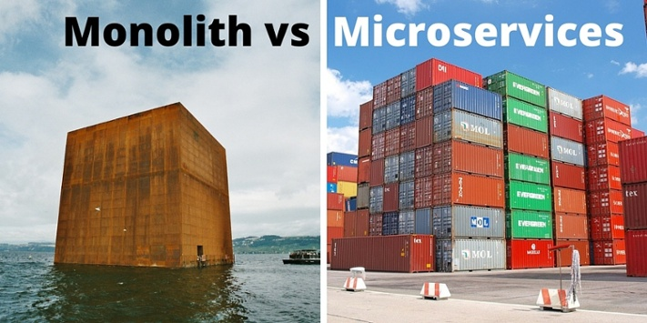

# Service Mesh Architecture를 알아보자

### Overview
- - -

이전 TIL에서 `MicroService Architecture`의 장단점에 대해서 알아봤습니다.

기존 `Monolithic Architecture`의 단점을 극복하고 Cloud환경에서 시스템 운영을 최적화 시키기 위해 많이 사용되고 있습니다.

이번 포스팅에서는 단점을 극복하기 위한 Architecture중 `Service Mesh Architecture`에 대해서 알아보겠습니다.

## Service Mesh Architecture

### MicroService Architecture의 단점
기존 `Monolithic Architecture`의 단점을 극복하고 작은 서비스들로 하나의 서비스를 이루는 것은 각각의 서비스들을 독립적으로 관리할 수 있다는 점에서 유연하게 운용할 수 있었지만,

거대해진 MSA시스템을 보면 수십개의 MicroService가 분리되어있고 운영환경에는 수천개의 서비스 인스턴스가 동작하고 있습니다.

물론 **관리자는 수백, 수천개의 인스턴스들을 모니터링하고 로깅해야하며 관리해야하는 책임**이 주어지게 됩니다.(부담....)

또한 서비스간의 통신도 매우 복잡해질수밖에 없습니다.

이와 같은 관리 및 프로그래밍 오버헤드를 낮추기 위해 나온 아키텍처가 `Service Mesh`입니다.

### Service Mesh
