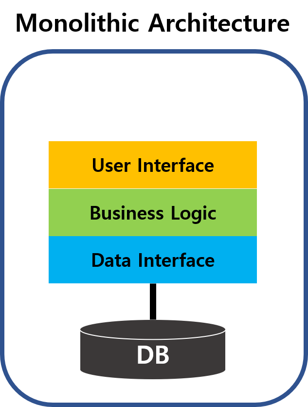
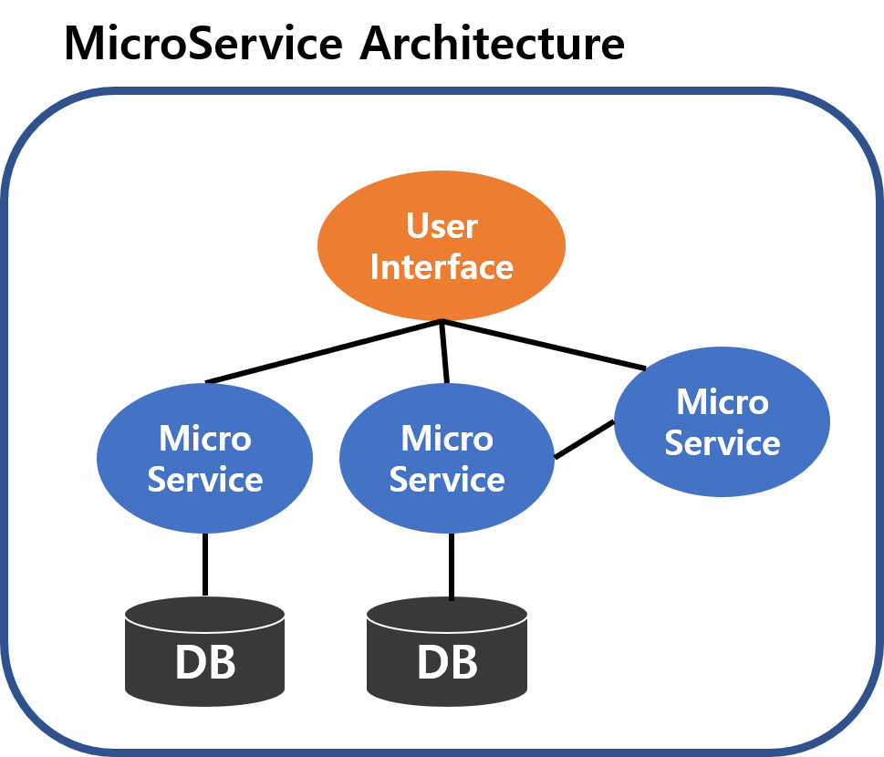

# MSA (MicroService Architecture)

### Overview
- - -
최근 클라우드, 컨테이너 시장이 급격히 성장하면서 **마이크로서비스**라는 단어가 많이 들리고 있습니다.
이번 TIL에서는 마이크로 서비스가 무엇인지 알아보겠습니다.

### MicroService Architecture?
- - -
마이크로서비스를 공부해보기전에 기존 서비스 구조가 어떠했는지 보겠습니다.

#### Monolithic Architecture
- - -
`Monolithic Architecture`가 각광을 받기 시작하면서 기존의 아키텍처를 지칭하는 의미로 생겨난 단어입니다.
모든 모듈은 **하나의 서비스 내부에 종속**되어 있으며 서비스 자체에 집중할 수 있는 구조로 되어 있습니다.

다시 말해 각기 다른 역할을 하는 **모듈들이 모여서 하나의 프로젝트**를 이룬다는 것입니다.

이는 개발, 빌드 배포가 용이할 수는 있지만, 프로젝트 규모가 커질수록 수정, 새로운 기능 추가가 어려워지고 성능이 저하될 수 있습니다.

- 장점
  - 단순한 구조
  - 개발환경과 방법의 통일성
  - 배포가 간편
  - End to End 테스트가 쉬움
- 단점
  - 프로젝트 규모가 커질수록 복잡도가 증가
  - 코드 전체를 읽기 어려움
  - 빌드시간 증가
  - 새로운 기능을 추가 어려움

#### MicroService Architecture
- - -
이런 기존 아키텍처의 단점을 보완하고자 `MicroService Architecture`를 사용합니다.

이름에서부터 알수있듯이, **작은 서비스 여러개가 모여서 하나의 시스템**을 제공하는 아키텍처를 뜻합니다.

`MicroService Architecture`에서 각 서비스는 작고 독립적이며 느슨하게 결합되어 있습니다.
때문에 서비스들을 독립적으로 배포할 수 있으며, 전체 프로그램을 빌드한 뒤에 재배치하지 않고도 기존 서비스들을 업데이트 할 수 있습니다.

서비스들이 독립적이라는 특징덕에 **클라우드**와 **컨테이너**와 잘 어울리는 아키텍처이기도 합니다.

- 장점
  - 전체 프로그램을 배포하지 않고도 수정 가능
  - 독립적으로 개발 가능
  - 서비스 하나가 다운되더라도 전체 서비스에 영향을 끼치지 않음
  - 서비스를 독립적으로 확장 가능, 리소스의 유연한 운용 가능
- 단점
  - 서비스간 통신방법이 필요하고 복잡함
  - 서비스끼리 테스트가 어려움
  - 복잡하고 독립된 구조로 인해 통합적인 유지관리가 어려워질 수 있음

#### Why MSA?
- - -
최근 들어서 MSA가 많이 사용되고 있는 이유는 무엇일까?
`MicroService Architecture`가 클라우드환경과 찰떡궁합이기 때문입니다.

`Monolithic` 구조를 다시 살펴보면, 각각의 모듈들이 합쳐져서 마치 큰 덩어리 처럼 구축되어 있습니다.
사용량이 적은 모듈을 삭제한다고 하더라도 전체 시스템의 스펙은 변하지 않기 때문에 사용량 단위로 과금을 해야하는 cloud 환경에서는 **비효율적**입니다.

하지만 `MicroService`구조는 서비스단위로 기능을 분리해서 구축할 수 있기 때문에, 사용하지 않는 기능 또는 사용량이 적은 기능을 축소해서 **효율화**시킬 수 있습니다.

클라우드 측면의 비용면에서는 MSA가 압승이지만 모든것이 완벽하지는 않습니다.

MSA로 시스템을 구축하게 되면 그에 따른 부가적인 서비스들도 늘어나게 되고 **관리해야할 포인트가 증가**하게 되는 단점도 존재합니다. 

그럼에도 불구하고 **서비스들의 재사용성, 클라우드환경에 친화적**이라는 장점때문에 현재 가장 핫한 아키텍처가 된 것 같습니다.