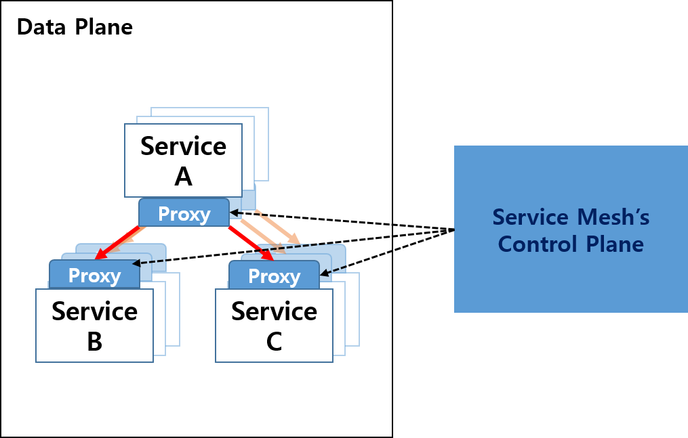
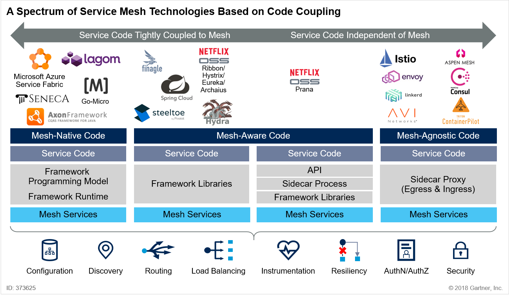

# Service Mesh Architecture를 알아보자

### Overview
- - -

이전 TIL에서 `MicroService Architecture`의 장단점에 대해서 알아봤습니다.

기존 `Monolithic Architecture`의 단점을 극복하고 Cloud환경에서 시스템 운영을 최적화 시키기 위해 많이 사용되고 있습니다.

이번 포스팅에서는 단점을 극복하기 위한 Architecture중 `Service Mesh Architecture`에 대해서 알아보겠습니다.

## Service Mesh Architecture

### MicroService Architecture의 단점
기존 `Monolithic Architecture`의 단점을 극복하고 작은 서비스들로 하나의 서비스를 이루는 것은 각각의 서비스들을 독립적으로 관리할 수 있다는 점에서 유연하게 운용할 수 있었지만,

거대해진 MSA시스템을 보면 수십개의 MicroService가 분리되어있고 운영환경에는 수천개의 서비스 인스턴스가 동작하고 있습니다.

물론 **관리자는 수백, 수천개의 인스턴스들을 모니터링하고 로깅해야하며 관리해야하는 책임**이 주어지게 됩니다.(부담....)

또한 서비스간의 통신도 매우 복잡해질수밖에 없습니다.
이와 같은 관리 및 프로그래밍 오버헤드를 낮추기 위해 나온 아키텍처가 `Service Mesh`입니다.

### Service Mesh
`Service Mesh`는 쉽게 말해 마이크로서비스간의 통신(네트워크)을 담당하는 요소입니다. 즉, 통신 및 네트워크 기능을 비즈니스 로직과 분리한 네트워크 통신 인프라입니다.

모든 서비스의 인프라 레이어로서 서비스들 간의 통신을 처리하며, 위의 언급된 많은 기능들을 포함하고 있습니다.

마이크로서비스 구성 요소간 상호 통신을 위해서는 
**Service Discovery**  
**서비스 라우팅**  
**Failure recovery**  
**load balancing(트래픽 관리)**  
**보안** 등의 문제를 처리할 수 있는 메커니즘이 필요합니다.

그래서 `Service Mesh` 아키텍처를 사용하여 다양한 메커니즘을 처리하곤 합니다.

기존의 서비스 아키텍처에서의 호출이 직접 호출방식이었다면,

`Service Mesh`에서의 호출은 서비스에 딸린 proxy끼리 이뤄지게 됩니다.

이는 서비스의 트래픽을 네트워크단에서 통제할 수 있게 하고, 또한 Client의 요구에 따라 proxy단에서 라우팅서비스도 가능하게 할 수 있습니다.

이런 다양한 기능을 수행하려면 기존 TCP기반의 proxy로는 한계가 있습니다.

그래서 Service Mesh에서의 통신은 사이드카로 배치된 **경량화되고 L7계층기반의 proxy**를 사용하게 됩니다.

프록시를 사용해서 트래픽을 통제할 수 있다는 것 까지는 좋은데, **서비스가 거대해짐에 따라 프록시 수도 증가**하게 됩니다.

이런 문제를 해결하기 위해서 각 프록시에 대한 설정정보를 **중앙집중화된 컨트롤러**가 통제할 수 있게 설계되었습니다.

프록시들로 이루어져 트래픽을 설정값에 따라 컨트롤하는 부분을 `Data Plane`이라고 하고,
프록시들에 설정값을 전달하고 관리하는 컨트롤러 역할을 `Control Plane`이라고 합니다.

## Service Mesh의 종류

Service mesh는 현재 크게 세가지 유형으로 구분할 수 있습니다.

**1) PaaS (Platform as a Service)의 일부로 서비스 코드에 포함되는 유형**
Microsoft Azure Service fabric, lagom, SENECA 등이 유형에 해당되며, 프레임워크 기반의 프로그래밍 모델이기 때문에 Service Mesh를 구현하는데 특화된 코드가 필요합니다. (Mesh-native Code)

**2) 라이브러리로 구현되어 API 호출을 통해 Service mesh에 결합되는 유형**
Spring Cloud, Netflix OSS(Ribbon/Hystrix/Eureka/Archaius), finagle 등이 이 유형에 해당되며, 프레임워크 라이브러리를 사용하는 형태입니다. 이중 Netfilix와 Prana는 sidecar 형태로 동작합니다. Service Mesh를 이해하고 코드를 작성해야합니다. (Mesh Aware Code)

**3) Side car proxy를 이용하여 Service mesh를 마이크로서비스에 주입하는 유형**
Istio/Envoy, Consul, Linkerd 등이 이 유형에 해당되며, sidecar proxy 형태로 동작됩니다. 따라서 Service Mesh와 무관하게 코드를 작성할 수 있습니다.

### Sidecar Pattern??

Sidecar pattern은 (컨테이너 배포방식의 경우) 모든 응용 프로그램 컨테이너에 추가로 **sidecar 컨테이너**가 배포됩니다. 

Sidecar는 서비스에 들어오거나 나가는 **모든 네트워크 트래픽**을 처리하게 됩니다.

가장 큰 특징은, 비즈니스 로직이 포함된 실제 서비스와 sidecar이 **병렬**로 구성되어있기 때문에, **서비스 호출에서 서비스가 직접 서비스를 호출하는 것이 아니라 proxy 를 통해서 호출하게됩니다.**

따라서, 대규모의 마이크로서비스 환경이라고 하여도 개발자가 별도의 작업 없이 **서비스의 연결 뿐만 아니라, 로깅, 모니터링, 보안, 트래픽 제어**와 같은 다양한 이점을 누릴 수 있습니다.

> 최근의 Service Mesh는 Sidecar pattern 유형이 recommended 되고 있는 추세입니다.

## API Gateway에도 비슷한 기능이 있지 않았나요??

API Gateway에서도 Service Discovery, 라우팅, 트래픽 관리와 같은 비슷한 기능을 담당한다고 말씀드렸습니다.

[API Gateway](./API-Gateway.md)

그럼 API Gateway와 Service Mesh는 무엇이 다른걸까요?
    - 적용되는 위치
      - API Gateway는 마이크로서비스 그룹의 외부 경계에 위치하여 역할을 수행하지만, Service Mesh는 경계 내부에서 그 역할을 수행합니다.
    - 아키텍쳐 형태
      - API Gateway가 중앙집중형 아키텍처여서 SPOF(Single Point Failure)을 생성한다면, Service Mesh는 분산형 아키텍처를 취하기 때문에 SPOF를 생성하지 않고 확장이 용이합니다.
    - 패턴