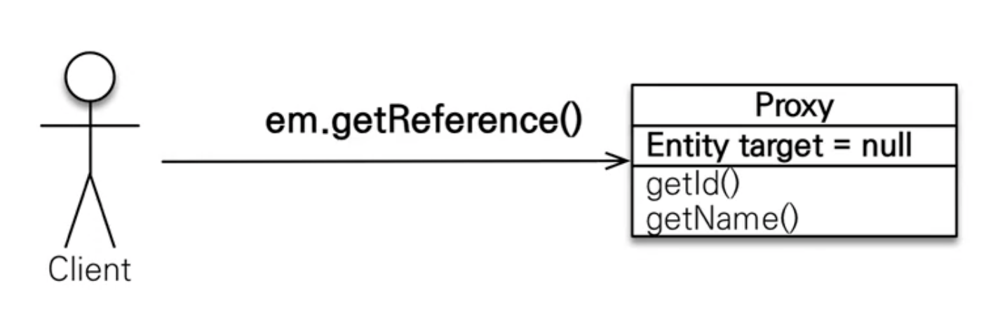
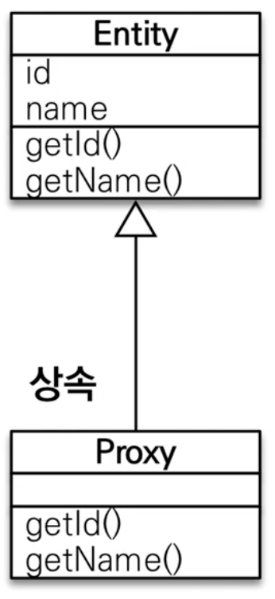
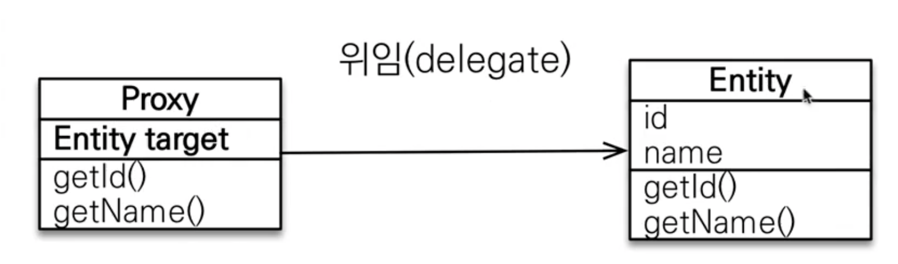
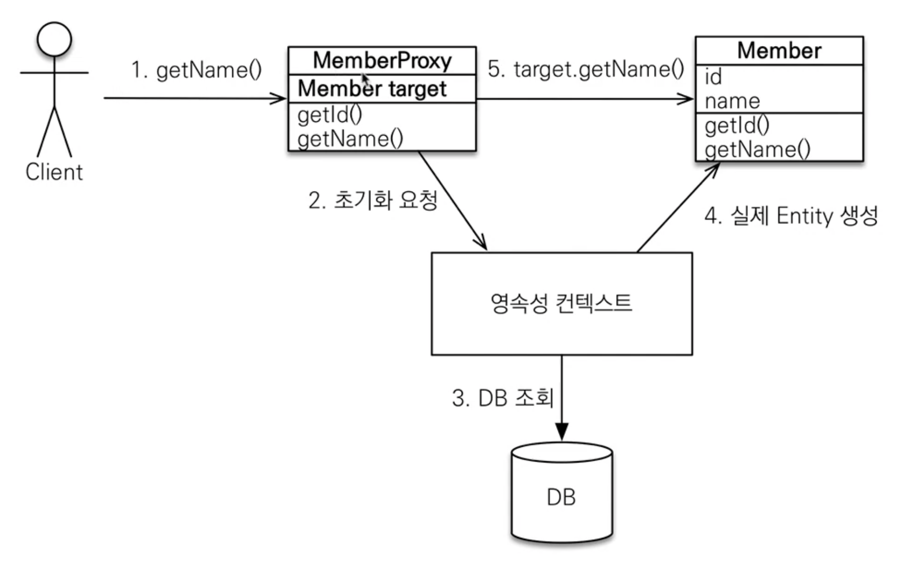
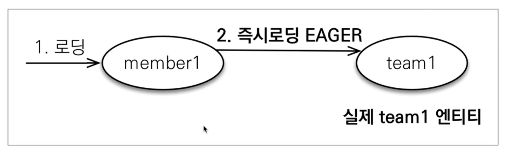
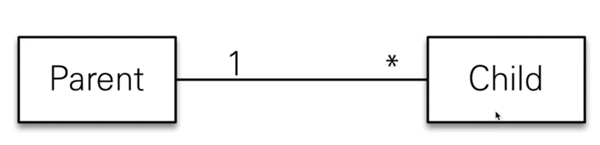
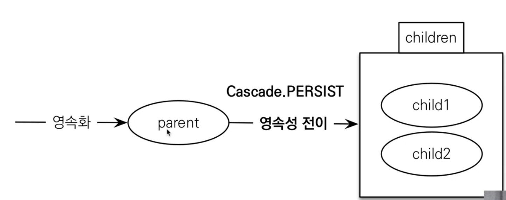

# Spring JPA 프록시와 연관관계 관리

- 차례
    - [프록시]()
    - [즉시 로딩과 지연 로딩]()
    - [영속성 전이 : CASCADE]()
        - [연관관계 편의 메소드]()
    - [고아 객체]()
    - [영속성 전이 + 고아 객체, 생명주기]()

## 프록시

---

- Member를 조회할떄 Team도 함께 조회해야할까?

**회원과 팀 함께 출력**

```java
public void printUserAndTeam(String memberId) {
	Member member = em.find(Member.class, memberId);
	Team team = member.getTeam();
	log.info("회원 이름 : " + member.getUsername());
	log.info("소속 팀 : " + team.getName());
}
```

**회원만 출력**

```java
public void printUser(String memberId) {
	Member member = em.find(Member.class, memberId);
	log.info("회원 이름 : " + member.getUsername());
}
```

### `em.find() VS em.getReference()`

- `em.find()` : 데이터베이스를 통해서 실제 엔티티 객체 조회
- `em.getReference()` : 데이터베이스 조회를 미루는 가짜(프록시) 엔티티 객체 조회



**프록시의 특징**

- 실제 클래스를 `상속` 받아서 만들어짐
- 실제 클래스와 `겉 모양`이 같다
- 사용하는 입장에서는 진짜 객체인지 프로시 객체인지 구분하지 않고 사용하면 됨
- 프록시 객체는 실제 객체의 참조(target)를 보관
- 프록시 객체를 호출하면 프록시 객체는 실제 객체의 메소드 호출

    



**프록시 객체의 초기화**

```java
Member member = em.getReference(Member.class, memberId);
member.getName();
```



### **프록시의 특징**

- 프록시 객체는 처음 사용할 때 `한번만 초기화`
- 프록시 객체를 초기화 할 때, `프록시 객체가 실제 엔티티로 변하지 X`, 초기화가 완료 되면 프록시 객체를 통해서 `실제 엔티티`에 접근 가능
- **프록시 객체는 원본 엔티티를 상속 받음, 따라서 타입 체크시 주의 (`==비교가 아닌, instance of사용`)**
- **영속성 컨텍스트에 찾은 엔티티가 이미 있으면 `em.getReference()`를 호출해도 실제 엔티티 반환**
- 영속성 컨텍스트의 도움을 받을 수 없는 `준영속 상태`일 때, 프록시를 초기화하면 예외를 터트림
    - `LazyInitializationException`

## 즉시 로딩과 지연 로딩

---

- Member를 조회할 때 Team도 함께 조회해야 할까?
    - 단순히 member 정보만 사용하는 비즈니스 로직

### **지연 로딩을 사용하면 `그 객체를 프록시로 조회`**


```java
Member member = em.find(Member.class, 1L);
```


```java
Team taem = member.getTeam();
//실제로 team을 사용하는 시점에 초기화(DB 조회)
team.getName(); 
```


### **즉시 로딩을 사용하면 `함께 조회`**



### **프록시와 즉시로딩 주의점**

- 가급적 `지연 로딩`만 사용 (실무)
- 즉시 로딩을 적용하면 예상하지 못한 SQL이 발생
- **즉시 로딩은 `JPQL에서 N + 1 문제`를 일으킨다**
- **@ManyToOne, @OneToOne은 `기본이 즉시로딩` ⇒ LAZY로 설정**
- @OneToMany, @ManyToMany는 기본이 지연 로딩

### **지연 로딩 활용 - 실무**

- 모든 연관관계에 지연로딩을 사용해라
- `실무에서 즉시 로딩을 사용하지 마라`
- `JPQL fetch 조인이나, 엔티티 그래프 기능`을 사용

## 영속성 전이 : CASCADE

---

- **특정 엔티티를 영속 상태로 만들 때 `연관된 엔티티도 함께 영속 상태`로 만들고 싶을 때 사용**
- 예 : 부모 엔티티를 저장할 때 자식 엔티티도 함께 저장

    

```java
@OneToMany(mappedBy="parent", cascade=CascaedType.PERSIST)
```



### **연관관계 편의 메소드**

```java
public class Parent {
	...
	
	//cascade는 부모인 클래스에 걸어주는 것 (양방향 매핑)
	@OneToMany(mappedBy = "parent", cascade = CascadeType.ALL)
	private List<Child> childList = new ArrayList<>();
	
	//연관관계 편의 메소드
	public void addChild(){
		childList.add(child);
		child.setParent(this);
	}

	...

}
```

### **영속성 전이 : CASCADE 주의**

- `영속성 전의는 연관관계를 매핑하는 것과 아무 관련이 없음`
- 엔티티를 영속화 할때 `연관된 엔티티도 함께 영속화`하는 편리함을 제공할 뿐
- 단일 소유자만 **CASCADE** 사용

**CASCADE의 종류**

- **ALL : 모두 적용**
- **PERSIST : 영속**
- **REMOVE : 삭제**
- MERGE : 병합
- PEFRESH : PEFRESH
- DETACH : DETACH

## 고아 객체

---

- `고아 객체 제거 : 부모 엔티티와 연관관계가 끊어진 자식 엔티티를 자동으로 삭제`
- orphanRemoval = true

```java
Parent parent1 = em.find(Parent.class, id);
parent1.getChildren().remove(0); //자식 컬렉션에서 제거
//Delete from child whre id = ? => 쿼리가 나간다
```

### **고아 객체 주의**

- `참조가 제거된 엔티티`는 다른 곳에서 참조하지 않는 `고아 객체로 보고 삭제`하는 기능
- **참조하는 곳이 하나일 때 사용 가능**
- **특정 엔티티가 개인 소유할 때 사용**
- @OneToOne, @OneToMany만 가능

> 개념적으로 부모 객체를 제거하면 자식을 고아가 됨 ⇒ 고아 객체 제거 기능을 활성화 하면, 부모를 제거할 때 자식도 함께 제거됨 (`CascaedType.REMOVE 처럼 동작`)

## 영속성 전이 + 고아 객체, 생명주기

---

- **Cascaed.ALL + orphanRemovel = true**
- 스스로 생명주기를 관리하는 엔티티는 `em.persist()` 영속화, `em.remove()`로 제거
- 두 옵션을 모두 활성화 하면 `부모 엔티티를 통해서 자식의 생명 주기를 관리`할 수 있음
- `도메인 주도 설계(DDD)의 Aggregate Root 개념`을 구현할 때 유용