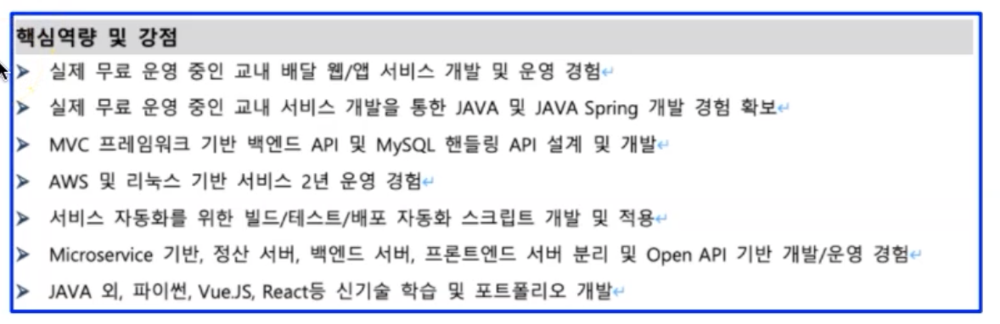

## 시작!!!
**모든 면접은 채용 공부 부터 시작**
1. 어떤 비즈니스를 하는 회사인지
   1. 어떤 프로그램을 개발하는지
2. 자격요건 확인
3. 우대사항 확인

## 이력서 관련 기술 면접
- 발표형
- 이력시 기반 논의형

## 발표형/이력서 기반 기술 면접 유형 준비
- 짧은 시간에 선명하게 기술력을 강조
  - 면접하시는 분들은 시간이 없음
    - 두괄식으로 선명하게 세가지 정도 강조!
  - 구성
    - 한 장으로 자격조건/우대조건을 강조하며 전체 요약
      - 이력서도 최상단에 자격조건/우대조건을 강조하면서 전체 요약
    - 포트폴리오 중심 개별 요약 페이지
    - 질문에 대비, 참고 페이지 무제한!
  - 
  - 자격 조건, 우대 사항, 특이 사항에 맞추어 강조
  - 자신있는 부분은 매우 상세하게!
  - 자신 없는 부분은 언급 X
  - 이력서 및 포트폴리오 상단에 넣기
  - 

## 이력서/이력 발표형 자료 작성 팁
- 자격요건, 우대사항에 부합하는 사람이라는 것을
  - 짧은 시간안에 파악할수 있도록
  - 핵심 요약해서, 최상단에 작성

