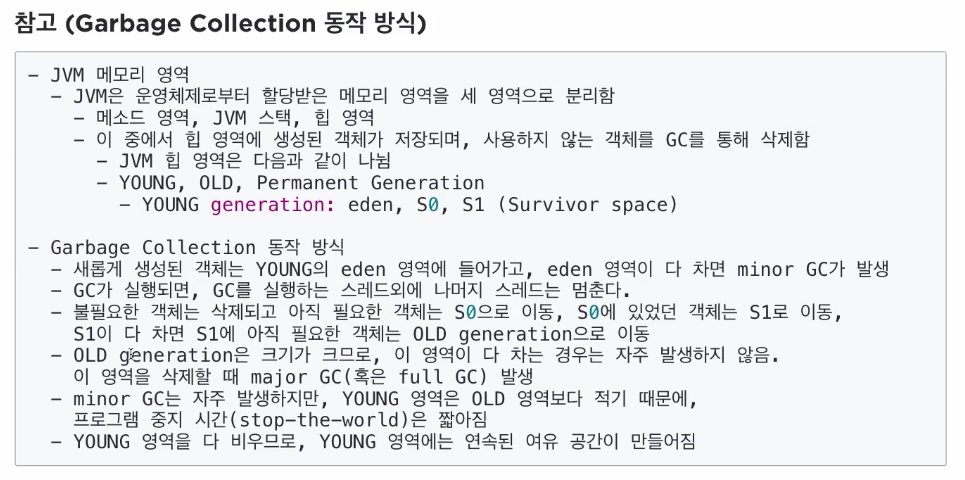
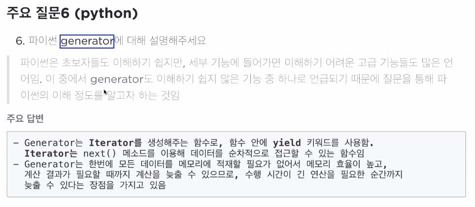
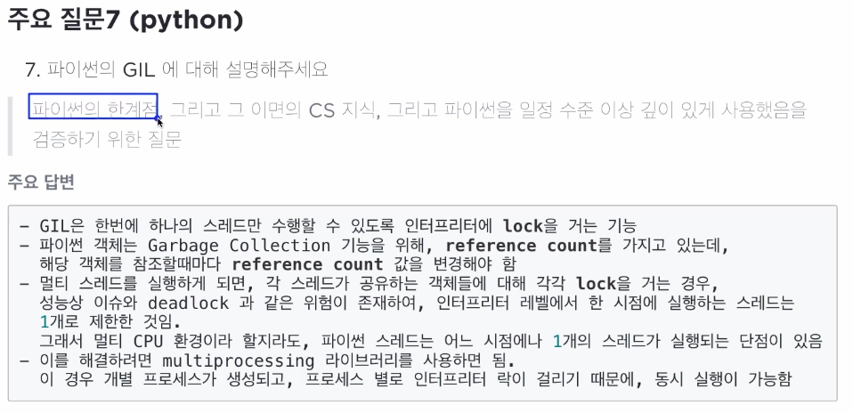

# Java 기술 면접

### JVM과 Java 프로그램 실행 과정을 설명해보세요
> Java 프로그램은 JVM 상에서, 실행되므로 JVM과 Java 프로그램의 구조/실행 방식을 잘 이해하고 있어야 보다 효율적인 프로그램 작성이 가능하다
**주요 답변**
- JVM이란 Java Virtual Machine(자바 가상 머신)의 약자로,
- **자바 프로그램을 자바 API를 기반으로 실행하는 역할을 함**
- **Java 프로그램 실행과정**은
    1. 프로그램이 실행되면 JVM이 OS부터 해당 프로그램이 필요로하는 메모리를 할당받는다
    2. 자바 바이트코드로 변환된(.class) 파일을 class 로더를 통해 JVM에 로딩한다
    3. 로딩된 class 파일은 execution engine을 통해 해석되고 실행된다
    4. 필요시 Garbage collection을 수행하여 불필요하게 할당된 메모리를 해제한다

### Garbage Collection이 필요한 이유
> 실무에서 Java 프로그램을 작성할 경우, 간혹 GC 문제로 인해 프로그램이 정상적으로 실행되지 않는 경우가 있음. 이런 실무적인 어려움으로 인해, GC에 대해 기본적인 내용을 잘 알고 있는 사람은 Java 프로그램 작성에 경험이 어느 정도 수준에 올라와 있다고 생각한다
**주요 답변**
- Java 프로그램은 메모리를 명시적으로 지정해서 해제하지 않기 때문에, Garbage Collection Mechanism을 통해, **경우에 따라 더 이상 필요없는 객체를 찾아 치우는 작업을 수행한다**
- 참고

### Overriding VS Overloading
> 언어 용어 관련 문제로, 실무에 필요한 질문이라기 보다는, 언어를 사용해봤는지, 가볍게 물어보기 쉬워서 물어보는 질문
**주요 답변**
- **Overriding : 상위 클래스에 존재하는 메서드를 하위 클래스에 맞게 재정의하는 것(메서드 이름, 파라미터 수 동일)**
- **Overloading : 두 메서드가 같은 이름을 가지고 있느나, 파라미터 수나 자료형이 다른 경우**

### interface와 abstract
> 보다 복잡한 Java 프로그램을 작성하다보면 사용해봤을 것이고, 따라서 이에 대해 어느 정도 이해하고 있는지를 기반으로 자바 프로그래밍 경험치를 판단하기 위한 질문
**주요 답변** 
- abstract : **추상 클래스는 추상 메소드를 1개 이상 가지고 있는 클래스를 위미**
  - **기존 메서드 이외에 추상 메서드를 상속시켜, 반드시 구현이 필요한 내용인 추상 메서드를 상속 받는 클래스에서 구현시키는 것이 주목적**
  - 추상 메소드를 1개 이상 가진 클래스는 객체 생성이 안되므로, 추상 클래스를 상속받는 클래스의 객체 생성을 위해서는 추상 메서드를 구현해야함(추상 메서드 구현을 강제함)
- interface : 상수와 메소드 선언 집합
  - 정의된 메소드를 implements 받는 곳에서 모두 구현을 강제함 Java는 단일 상속만을 지원하기 때문에, 추상 클래스를 상속은 클래스를 상속 받을 수 없음
  - **하지만 인터페이스는 다중 상속이 가능함**

### 디자인 패턴이 무엇인지, 그리고 싱글톤에 대해 간단히 설명하시오
> 디자인 패턴을 선호하는 개발자의 경우, 디자인 패턴에 대해 잘 알고 있는지를 판단하기 위해 질문함
**주요 답변**
- 디자인 패턴은 공통적인 소프트웨어 코드 작성 문제를 해결하는데 도움이 될 수 있는 코드 패턴
- 싱글톤은 전체 프로그램에서 단 1개의 객체를 생성해서 공유할 수 있는 코드 패턴

> 참고 (Python)

# 주요 후보 문항 : Java
- Java의 특징에 대해 정단점을 중심으로 설명해주세요
- 객체와 클래스의 차이점에 대해 간략히 설명해주세요
- Java 메모리 영역에 대해 간략히 설명해주세요
- 디자인 패턴에 대해 생각나는 것 몇가지를 간략히 설명해주세요
- private, protected, public, default 키워드에 대해 설명해 주세요
- 객체지향 5대 원칙(SOLID)에 대해 설명해주세요
> 파이썬은 기술 면접을 통해 내부적인 기술적 내용에 대해 묻기보다는 손코딩등에서 활용되는 경우가 많다

# 주요 후보 문항 : 네트워크
- OSI 7계층에 대해 간략히 설명해주세요
- HTTP와 HTTPS의 차이점에 대해 간략히 설명해주세요
- 쿠키와 세션의 차이점에 대해 간략히 설명해주세요
- RESTful의; 개념에 대해 간략히 설명해주세요
- TCP의 3-way-handshake와 4-way-handshake 방식의 차이점에 대해 간략히 설명해주세요

# 주요 후보 문항 : 웹(프론트엔드 + JavaScript)
- MVC 패턴에 대해 설명해주세요
- 브라우저의 렌더링 과정에 대해 설명해주세요
- 가상 DOM과 DOM의 차이점에 대해 설명해주세요
- ES6에 추가된 스펙에 대해 설명해주세요
- var와 let/const의 차이점에 대해 설명해주세요
> 웹은 굉장히 실무적인 면접이 많음. 주로 프레임워크의 개별 기능을 써봤는지, 개념과 장단점에 대해 묻는 경우가 많음

# 주요 후보 문항 : 운영체제 & 데이터베이스
- deadlock의 개념 및 deadlock의 해결 방법에 대해 설명해주세요
- 뷰텍스와 세마포어의 차이점에 대해 설명해주세요
- 가상 메모리에 대해 설명해주세요
- 컨텍스트 스위칭에 대해 설명해주세요
- Transaction의 개념에 대해 설명해주세요
- 관계형 데이터베이스 시스템과 NoSQL의 차이점에 대해 설명해주세요

# 주요 후보 문항 : 자료 구조 & 알고리즘
- 배열과 링크드 리스트의 장단점에 대해 설명해주세요
- BST의 최악의 시간 복잡도와 최악의 시간이 걸리는 케이스에 대해 설명해주세요
- 해쉬 테이블에 대해 설명해주세요
- Fibonacci공식을 recursive와 dynamic programming으로 구현시 차이점에 대해 설명해주세요
- DFS와 BFS에 대해 설명해주세요
> 자료 구조와 알고리즘은 코딩 테스트를 통해 검증함

