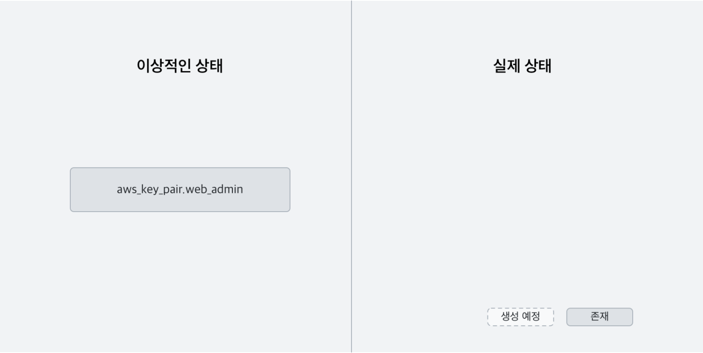
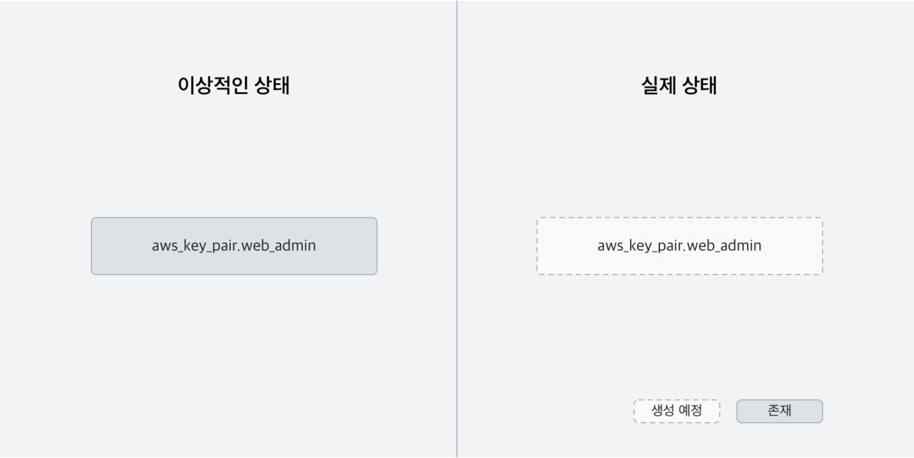
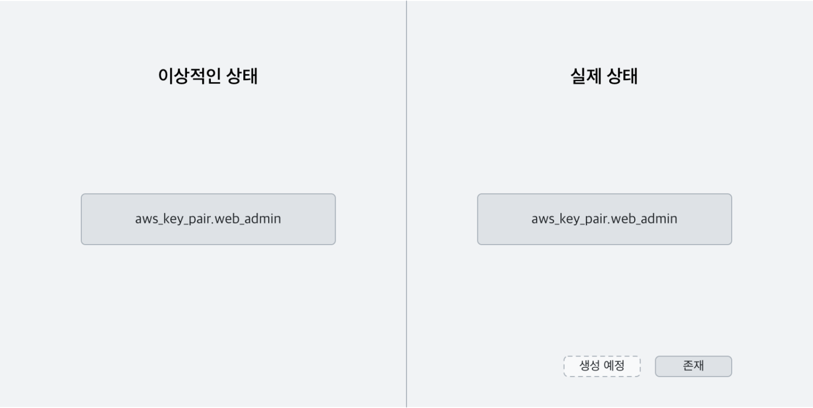
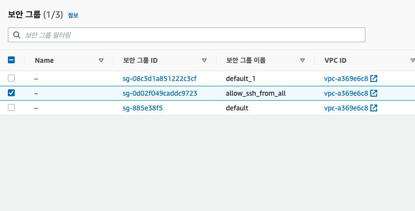

# Terraform Study

**Terraform : 인프라스트럭처 도구 (프로비저닝 도구)**
- 코드소서의 인프라스트럭처를 지향하고 있는 도구
- GUI나 웹 콘솔을 통해 서비스 실행에 필요한 리소스를 관리하는 대신 필요한 일소스들을 선언적인 코드로 작성해 관리할 수 있도록 해줍니다.

### 테라폼 설치
- `Mac`에서는 `Homebrew`를 사용해 간단히 설치 가능합니다.
  ```sh
    $ brew install terraform
  ```

- 버전 확인
  ```sh
    $ terraform version
  ```

### 테라폼 버전 관리
- 특정 버전의 테라폼을 사용하고 싶거나, 여러 버전을 사용할 필요가 있을 때는 `tfenv`를 사용하면 편리합니다.
- `tfenv`는 테라폼 버전 매니저로 `Mac`, `Linux`, `Windows`를 지원하고 있습니다.
  <br>
  ```sh
    $ brew install tfenv
    $ tfenv install 0.12.23
    $ tfenv use 0.12.23
    $ terraform version
  ```

### 테라폼을 사용한 웹 애플리케이션 인프라스트럭처 프로비저닝
- 1단계 - 먼저 아마존 웹 서비스 계정을 준비하고, `API 키`를 설정합니다.
- 2단계 스텝 1 - 인프라스트럭처를 정의하는 `HCL 언어`로 필요한 리소스를 선언합니다.
- 2단계 스텝 2 - 선언된 리소스들이 생성가능한지 계획(`Plan`)을 확인합니다.
- 2단계 스텝 3 - 선언된 리소스들을 아마존 웹 서비스에 적용(`Apply`)합니다.
- 3단계 - 웹 애플리케이션을 `배포`합니다.

### 테라폼의 기본 개념들
#### `프로비저닝 (Provisioning)`
- 어떤 프로세스나 서비스를 실행하기 위한 준비 단계를 프로비저닝이라고 이야기합니다. 
- 프로비저닝에는 크게 네트워크나 컴퓨팅 자원을 준비하는 작업과 준비된 컴퓨팅 자원에 사이트 패키지나 애플리케이션 의존성을 준비하는 단계로 나뉘어집니다. 
- 명확한 경계는 불분명하지만 테라폼은 전자를 주로 다루는 도구입니다.

#### `프로바이더 (Provider)`
- 테라폼과 `외부 서비스를 연결해주는 기능`을 하는 모듈입니다. 
- 예를 들어 테라폼으로 AWS 서비스의 컴퓨팅 자원을 생성하기 위해서는 aws 프로바이더를 먼저 셋업해야합니다.

#### `리소스 (Resource)`
- 리소스란 특정 프로바이더가 제공해주는 `조작 가능한 대상의 최소 단위`입니다. 
- 예를 들어 AWS 프로바이더는 aws_instance 리소스 타입을 제공하고, 이 리소스 타입을 사용해 Amazon EC2의 가상 머신 리소스를 선언하고 조작하는 것이 가능합니다. 
- EC2 인스턴스, 시큐리티 그룹, 키 페어 모두 aws 프로바이더가 제공해주는 리소스 타입입니다.

#### `HCL (Hashicorp Configuration Language)`
- HCL은 `테라폼에서 사용하는 설정 언어`입니다. 테라폼에서 모든 설정과 리소스 선언은 HCL을 사용해 이루어집니다. 테라폼에서 HCL 파일의 확장자는 `.tf`를 사용합니다.

#### `계획 (Plan)`
- 테라폼 프로젝트 디렉터리 아래의 모든 `.tf 파일의 내용을 실제로 적용 가능한지 확인하는 작업`을 계획이라고 합니다. 테라폼은 이를 `terraform plan` 명령어로 제공하며, 이 명령어를 실행하면 어떤 리소스가 생성되고, 수정되고, 삭제될지 계획을 보여줍니다.

#### `적용 (Apply)`
- 테라폼 프로젝트 디렉터리 아래의 모든 `.tf 파일의 내용대로 리소스를 생성, 수정, 삭제하는 일`을 적용이라고 합니다. 테라폼은 이를 `terraform apply` 명령어로 제공합니다. 이 명령어를 실행하기 전에 변경 예정 사항은 plan 명령어를 사용해 확인할 수 있습니다. 적용하기 전에도 플랜의 결과를 보여줍니다.

### 첫 번째 단계 - AWS 설정
- **이미 AWS 계정을 가지고 있으며, IAM 계정에 대해 이해하고 있다면 두 번째 단계로 넘어가주세요.**
<br>
1. AWS에 로그인 합니다. 
2. AWS IAM을 발급합니다.
3. 해당 권한은 기존 정책에 직접 연결하여 `AdministratorAccess`를 체크해주어 발급합니다.

### 두 번째 단계 - HCL로 리소스 정의하고 AWS에 프로비저닝

#### AWS 프로바이더 정의
```sh
$ mkdir web_infra
$ cd web_infra
$ touch provider.tf web_infra.tf
```

> 디렉터리 이름과 파일 이름에 특별한 원칙은 없습니다.
> 테라폼은 기본적으로 특정 디렉터리에 있는 모든 .tf 확장자를 가진 파일을 전부 읽어들인 후, 리소스 생성, 수정, 삭제 작업을 진행합니다. 
> 파일은 상황에 따라 적절히 나눠줄 필요가 있지만, 여기서는 작성할 내용이 많지 않기 때문에  provider.tf와 web_infra.tf 두 개로 나눠서 작성해보겠습니다.


- HCL AWS 프로바이더 정의 (provider.tf)
```sh
provider "aws" {
  access_key = "<AWS_ACCESS_KEY>"
  secret_key = "<AWS_SECRET_KEY>"
  region = "ap-northeast-2"
}
```
region은 리소스를 정의할 AWS리전을 의미합니다. 여기서 사용한 `ap-northeast-2`은 서울 리전을 의미합니다.

### 테라폼 프로젝트 초기화
루트 디렉터리에서 `terraform init` 명령어를 실행합니다.

## 첫 번째 이터레이션 : EC2용 SSH 키 페어 정의
지금까지 테라폼을 사용하기위한 준비 작업이었다면, 이제 AWS 리소스를 정의할 차례입니다. 첫번째 리소스는 `aws_key_pair`입니다.  
이 리소스는 AWS EC2를 생성할 때 사용되는 리소스입니다. EC2 인스턴스를 생성하더라도 `key_pair`가 없다면 생성한 인스턴스에 접근할 수 없습니다.
따라서 인스턴스를 생성하기 전에 키 페이를 먼저 생성해야합니다.

### 첫 번째 스탭 : HCL언어로 필요한 리소스를 정의
`web_infra.tf`에 다음과 같은 내용을 추가해줍니다.
```sh
resource "aws_key_pair" "web_admin" {
  key_name = "web_admin"
  public_key = "<PUBLIC_KEY>"
}
```
주의 : `resource` 키워드 다음에 `"aws_key_pair"` `"web_admin"`과 같이 두개의 문자열이 온다는 것입니다. 

**첫 번쨰 문자열은 리소스 타입입니다.**
이 자리에 올 수 있는 값들은 프로바이더에서 제공하는 리소스 타입의 이름들로 한정되어 있습니다.  

**두 번쨰 문자열은 이 리소스에 임의로 붙이는 이름입니다.**
이 이름은 테라폼 코드의 다른 곳에서 이 리소스를 찹조하기 위해서 사용합니다.
리소스 타입과 이름을 `.`으로 이어 `aws_key_pair.web_admin`과 같은 형식으로 참조합니다.

`key_name`은 AWS 상에 현재 정의하는 키 페어를 등록할 이름입니다.  
필수는 아니지만 편의를 위해 리소스의 이름과 같은 이름을 사용하는 것을 권장합니다.

`public_key`에는 접속에 사용할 공개키의 값을 넣어야합니다. 로컬 환경에 미리 생성해둔 SSH키가 있다면 이 키를 사용해도 무방합니다.

```sh
$ ssh-keygen -t rsa -b 4096 -C "<EMAIL_ADDRESS>" -f "$HOME/.ssh/web_admin" -N ""
```
명령어를 실행하고 `~/.ssh` 디렉터리를 확인하면 `web_admin`과 공개키 `web_admin.pub` 두 개의 파일이 생성되어 있을 것입니다.  

```sh
public_key = file("~/.ssh/web_admin.pub")
```
다음과 같이 공개키의 경로를 `public_key` 속성을 지정합니다.

> 최종적인 코드는 다음과 같습니다.
```sh
resource "aws_key_pair" "web_admin" {
  key_name = "web_admin"
  public_key = file("~/.ssh/web_admin.pub")
}
```

### 두 번쨰 스텝 : 선언한 리소스들이 생성가능한지 계획(Plan)을 확인
앞서 작성한 `aws_key_pair` 리소스를 실제로 AWS에 생성할 수 있는지 확인해야합니다.

`terraform plan`을 실행합니다.  
명령어를 사용하면 현재 정의되어있는 리소스들을 실제로 프로바이더에 적용했을 때 테라폼이 어떤 작업을 수행할지 계획을 보여줍니다.

```sh
$ terraform plan
...
Terraform will perform the following actions:

  # aws_key_pair.web_admin will be created
  + resource "aws_key_pair" "web_admin" {
      + fingerprint = (known after apply)
      + id          = (known after apply)
      + key_name    = "web_admin"
      + key_pair_id = (known after apply)
      + public_key  = "ssh-rsa ...."

Plan: 1 to add, 0 to change, 0 to destroy.
```

테라폼 앞에 있는 + 문자는 리소스를 생성하겠다는 의미입니다.

`plan`의 작동 방식을 이해하기 위해서는 테라폼의 동작 방식을 이해할 필요가 있습니다.

### 테라폼의 동작 방식 (Plan)
테라폼에서 리소스는 선언적으로 기술됩니다. 테라폼은 `.tf` 파일에 기술되어있는 모든 리소스를 읽어들이고 먼저 리소스들이 존재하는 상태를 가정합니다.  
편의상 이를 `이상적인 상태`라고 부릅니다.  
예를 들어 `aws_key_pair.web_admin`은 이상적인 상태에 존재하는 리소스 입니다.  
**하지만 이 리소스는 실제로 생성된 적은 없기 때문에 프로바이더에 지정한 AWS 계정에는 존재하지 않습니다.** 즉, 내 AWS 계정의 실제 상태에는 `aws_key_pair.web_admin`이 아직 존재하지 않습니다.



**<리소스를 추가하기 전의 최초 상태>**

테라폼의 가장 중요한 역할은 실제 상태를 이상적인 상태와 동일하게 만드는 일입니다.
테라폼에서는 이 작업을 **적용한다(apply)**고 표현합니다. **테라폼 plan은 apply하기 전에 이상적인 상태와 실제 상태를 비교해 둘을 동일하게 만들기 위해서 해야할 일을 찾아내는 작업**입니다.

이 예제에서 aws_key_pair.web_admin 리소스는 이상적인 상태에만 존재하고 실제 상태에는 존재하지 않습니다. 따라서 테라폼이 실제 상태를 이상적인 상태와 동일하게 만들기 위해서는 실제 상태에 aws_key_pair.web_admin 리소스를 생성해야 합니다.



**<terraform plan이 보여주는 리소스 생성 계획>**

> 이게 바로 + resource "aws_key_pair" "web_admin"이 의미하는 바입니다. 그 아래로 보여지는 정보들은 새로 추가될 리소스의 속성들입니다. 

### 세 번쨰 스텝 : 선언된 리소스들을 아마존 웹 서비스에 적용(Apply)

`plan`을 통해 확인한 내용을 실제로 프로바이더에 적용해봅니다. `terraform apply` 명령어를 실행합니다.

```sh
$ terraform apply
...
Terraform will perform the following actions:

  # aws_key_pair.web_admin will be created
  + resource "aws_key_pair" "web_admin" {
      + fingerprint = (known after apply)
      + id          = (known after apply)
      + key_name    = "web_admin"
      + key_pair_id = (known after apply)
      + public_key  = "ssh-rsa ..."
    }

Plan: 1 to add, 0 to change, 0 to destroy.

Do you want to perform these actions?
  Terraform will perform the actions described above.
  Only 'yes' will be accepted to approve.

  Enter a value:
```
리소스를 생성하기 전에 plan 결과를 보여주고 **yes를 입력해야만 리소스를 생성합니다.** 


**<정상적으로 aws_key_pair.web_admin 리소스가 생성된 것을 확인할 수 있습니다. 추가된 리소스는 웹 콘솔의 EC2 서브 메뉴에서도 확인할 수 있습니다.>**

앞서 설명했듯이 테라폼은 로컬에 정의된 이상적인 상태와 실제 상태를 동일하게 만듭니다. 계획에서 보여준대로 실제 상태에 aws_key_pair.web_admin 리소스를 생성했습니다.



**<tf 파일들에 정의된 리소스들을 AWS에 적용한 후의 상태>**

이제 이상적인 상태와 실제 상태는 같습니다. 이 상태에서 `terraform plan`을 실행해봅니다.

```sh
$ terrafrom plan
...
aws_key_pair.web_admin: Refreshing state... [id=web_admin]

------------------------------------------------------------------------

No changes. Infrastructure is up-to-date.
```

현재 상태를 최신화하고 다시 두 상태를 비교합니다. 결과는 No changes. **즉, 두 상태가 같기 때문에 더 이상 변경할 게 없다는 의미입니다.** 테라폼에서 리소스를 선언적으로 정의한다는 의미는 여기에서도 잘 드러납니다.

**테라폼의 리소스 정의는 어떤 리소스를 생성하라는 절차적인 명령어가 아닙니다. 단지 이상적인 상태를 정의할 뿐입니다.** 따라서 `terraform apply`를 여러번 실행하더라도 아무런 일도 일어나지 않습니다.

`terraform apply`를 실행하고 나면 프로젝트 상에 중요한 변화가 하나 생깁니다. 작업 디렉터리 아래에 `terraform.tfstate` 파일이 하나 생성됩니다. **이 파일에는 실제 상태를 임시로 저장하는 동시에 테라폼에서 관리되는 리소스의 목록을 관리합니다.**

## 두 번쨰 이터레이션 : SSH 접속 허용을 위한 시큐리티 그룹
두 번째로 정의할 리소스는 `aws_security_group`입니다.  
이 리소스 역시 키 페어와 마찬가지로 인스턴스를 정의하는 데 필요합니다.  
**인스턴스를 생성해도 밖에서 접근할 수 있는 방법이 없다면 사용할 수가 없습니다.**
따라서 SSH port를 외부에 열어주는 시큐리티 그룹을 만들 필요가 있습니다. 다음 내용을 `web_infra.tf` 맨 아래에 추가해줍니다.

```sh
resource "aws_security_group" "ssh" {
  name = "allow_ssh_from_all"
  description = "Allow SSH port from all"
  ingress {
    from_port = 22
    to_port = 22
    protocol = "tcp"
    cidr_blocks = ["0.0.0.0/0"]
  }
}
```

`name`과 `description`에는 각각 시큐리티 그룹의 이름과 설명을 기입합니다. 여기서 특이한 점은 **ingress 속성에 직접 값을 지정하는 대신 중괄호 블록이 따라온다는 점입니다.** `ingress`는 **인바운드 트래픽**을 정의하는 속성으로 **시큐리티 그룹에는 ingress 블록이 하나 이상 올 수 있습니다.**

`ingress` 블록 안에는 **from_port, to_port, protocol, cidr_blocks** 속성을 지정합니다.

`from_port`와 `to_port`는 열어줄 **포트의 범위를 의미**합니다.  
예를 들어 from_port가 60001이고 to_port가 60010이면, 60001부터 60010까지 10개의 포트를 열어줍니다. 여기서는 SSH(22) 포트만 허용하므로 둘 다 22로 지정합니다.

`protocol`은 통신에 사용할 **프로토콜**입니다. SSH는 TCP를 사용하므로 tcp를 지정합니다.

마지막으로 `cidr_blocks`은 배열로 **시큐리티 그룹을 적용할 사이더 범위를 지정**합니다. 여기서 지정된 0.0.0.0/0은 모든 IP에서 접속을 허용한다는 의미입니다.

이제 plan을 실행하고 apply를 실행해줍니다.



**<AWS에 시큐리티 그룹 적용>**