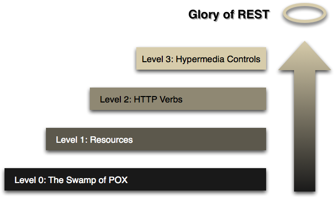

# RESTful

## REST
REpresentational State Transfer
표현, 상태, 전달

> 자원의 표현을 가지고 상태 전달

자원의 표현 ⇒ HTTP URI
상태 전달 ⇒ HTTP Method

## RESTful
REST란 아키텍텨 스타일의 제약조건을 모두 만족하는 시스템

## REST 아키텍쳐의 제약조건
1. Clinet - Server
2. Stateless
3. Cache
4. Uniform Interface
    1. Identification or Resorces
    2. Manipulation of Resources throuhg Representation
    3. Self-Descriptive Messages
    4. Hypermedia As The Engine Of Application State
5. Layered System
6. Code-On-Demand(Option)

## Richardson Maturity model

### Level 0

- HTTP를 RPC를 기반으로 원격 통신을 위한 터널링 매커니즘으로 사용
- POX : Plan Of XML ⇒ 꼭 XML이 아니여도 됨
- `RPC : 별도의 원격 제어를 위한 코딩 없이 다른 주소 공간에서 함수나 프로시저를 실행할 수 있게하는 프로세스간 통신 기술`

### Level 1

- 리소스를 도입한다 (개별 리소스)

### Level 2

- HTTP Method 사용

### Level 2

- HAREOAS 도입

## 1. Clinet - Server (Level 0이 기본)

- Client ⇒ Server (Reequest)
- Server → Client (Response)
- 서버는 API 제공 및 비즈니스 로직 처리, 저장
- 클라이언트는 사용자 인증 컨텍스트를 관리
- `서버와 클라이언트의 역할를 따로 구분`

## 2. Stateless

- 클라이언트와 서버의 통신에는 상태가 없어야한다
- 모든 요청을 필요한 모든 정보를 포함하고 있어야한다
- *어떠한 요청에 대해 요청자의 State를 관여하지 않는다는 소리. `즉 같은 요청을 A가 보낼 때와 B가 보낼 때가 같아야한다.`*
- *Stateless할 경우 어떠한 클러스터 내의 어떠한 서버에 요청을 보내든 같은 결과를 얻을 수 있지만, Stateful한 경우 `A의 세션 정보가 A' 서버에 저장되어 있는 경우, A'서버가 아닌 B' 서버에 요청을 보내게 된다면, B'에는 A의 세션 정보가 없으므로 Authentication이 이루어질 수 없다.` 하지만 이 또한 서버들이 공유할 수 있는 DB에 session을 관리함으로써 해결하기도 하므로 정답은 없는 것 같다.)*

## 3. Layered System

- 계층으로 구성이 가능해야한다
- 클라이언트 입장에서는 서버만 호출
- 서버는 다중 계층 분할
    - 비즈니스 로직 계층, 로드밸런싱 계층 등등

## 4. Uniform Interface

### 4 - 1. Manipulation of Resources throuhg Representation

- Representation의 형태는 content-type으로 결정
- xml, html, json

---

### 4 - 2. Identification or Resorces

- 자원은 유일하게 식별가능해야한다
- Resorces가 하나 이상인 유일한 특정 주소인 URI로 식별된다  `user/1`

---

### 4 - 3. Manipulation of Resources throuhg Representation

- HTTP Method로 표현(CRUD)을 담아야한다
- 안전한 오퍼레이션과 안전하지 않은 오퍼레이션 간의 강한 분리를 제공해야한다

### 4 - 4. Self-Descriptive Messages

- 메시지는 스스로 설명해야한다
- 메시지는 요청 작업을 완료할 수 있도록, 응답을 이해할 수 있도록 충분한 정보들을 HTTP Method, Status Code, Header등을 활용해 전달해야한다.

## 5. Cache

- 일반적인 서비스에서 60 ~ 80% 가량의 트랜잭션이 Select와 같은 조회성 트랙잭션
- GET은 얼마든지 호출해도 매번 같은 결과를 만들어내므로 캐싱이 가능하다
- 
---

## 4. Uniform Interface

### 4 - 5. Hypermedia As The Engine Of Application State

- 클라이언트가 전적으로 서버와 동적인 상호작용이 가능함
- 클라이언트가 서버로부터 어떠한 요청을 할 때, 요청에 필요한 URI를 응답에 포함시켜 반환하는 것
- `사용자 정보를 생성하는 요청을 보낸 이후, 서버에서는 이를 조회, 수정, 삭제 할때 필요한 모든 URI를 동적으로 알려준다`
- 하이퍼링크를 통해서 애플리케이션의 상태가 전이되어야한다
- HTTP Response에 다음 Action이나 관계되는 리소스에 대한 HTTP Link를 함께 리턴
- `요청 URI가 변경되더라도 클라이언트에서 동적으로 생성된 URI를 사용함으로써, 클라이언트가 URI 수정에 따른 코드를 변경하지 않아도 됨`

## 6. Code-On-Demand(Option-선택)

- 서버가 네트워크를 통해 클라이언트에게 프로그램(JavaScript 등)을 전달하면 그 프로그램이 클라이언트에서 실행 될 수 있어야 한다.

# 정리
1. REST는 `소프트웨어 아키텍쳐`의 한 형식이다.
2. REST 아키텍쳐는 여러 개의 `제약 조건`을 가지고 있다.
3. RESTful은 위의 제약 조건들을 `모두` 만족 시켜야 한다.
4. `HTTP Method`, `Status Code`를 용도에 맞게 써야하고, `HTTP Header`와 `Link`를 신경쓰면 RESTful한 서비스를 설계할 수 있다.